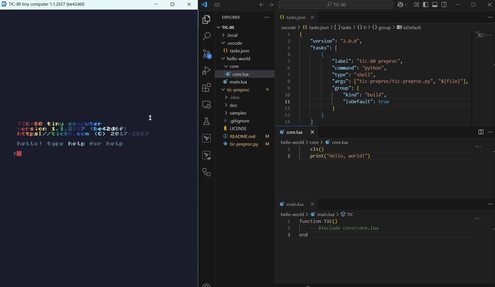

# tic-preproc

Yet another [TIC-80](https://github.com/nesbox/TIC-80) cartridge preprocessor/bundler.

Code TIC-80 with your favorite editor, in any language!



## 🚀 Quick start (VS Code)

Clone tic-preproc:
```sh
cd <tic-80-carts-directory>
git clone https://github.com/radwan92/tic-preproc.git
```

Copy the `.vscode` directory to your carts directory:
```sh
cp -r tic-preproc/.vscode .
```

Add an include directive to your TIC-80 code:
```lua
-- #include my-project/file.lua
```

Run the preprocessor: `Ctrl+Shift+B` or chose `tic-80 preproc` task from the command palette.

🎉 Voilà! Your code is now bundled and ready to be run in TIC-80. 🎉

## ❓Why

TIC-80 is great, but its code editor is limited in its capabilities.
Using external code editor is not supported out of the box, and it requires manual copying of the code back to the TIC-80 editor.
There are some great [bundlers, stichers and preprocessors](https://github.com/nesbox/TIC-80/wiki/tools#bundling), 
but all of them seem to either require some manual steps or a per-project configuration.

I wanted something that:
* Doesn't require re-running TIC-80 every time I make a change
* Doesn't require any preconfiguration or re-configuration for every new file
* Let's me jump between the projects without any setup
* Is easy to fix or extend on the spot

tic-preproc is an attempt to fulfill these requirements.

## ☑️ Prerequisites

To use tic-preproc, you need to have python3 installed on your system. 
You can download it from the [official website](https://www.python.org/downloads/).

For Winget users:
```sh
winget install -e --id Python.Python.3.11
```

## ⚠️ Word of caution

This tool is in an early stage of development, and it may not work as expected. 
Use it at your own risk 💀.

It does backup the files before modifying them, but any subsequent executions will overwrite the previous backups. 
It is recommended to use a version control system to keep track of the changes.

Tested on Windows, TIC-80 version 1.1

## 📦 Installation

Go to your TIC-80 carts directory (usually `%APPDATA%\com.nesbox.tic\TIC-80` on Windows) and clone the repository there:
```sh
git clone https://github.com/radwan92/tic-preproc
```

### 🪟 VS Code setup

Add a [VS Code task](https://code.visualstudio.com/docs/editor/tasks):
```json
{
    "version": "2.0.0",
    "tasks": [
        {
            "label": "tic-80 preproc",
            "command": "python",
            "type": "shell",
            "args": ["tic-preproc/tic-preproc.py", "${file}"],
            "group": {
                "kind": "build",
                "isDefault": true
            }
        }
    ]
}
```
> ❕tl;dr; save the above code as <...>/TIC-80/.vscode/tasks.json

From here you can run the task by pressing `Ctrl+Shift+B` or by selecting it from 
the command palette when editing any of the given project files.

This assumes the following directory structure:
```
TIC-80
├── tic-preproc
|   ├── tic-preproc.py
|
├── .vscode
|   ├── tasks.json
|
├── your-project
    ├── ...
```
where TIC-80 is the carts directory (usually `%APPDATA%\com.nesbox.tic\TIC-80` on Windows).

### 🤷 Other IDEs

You can set up a similar task in any other IDE that supports running external commands.

All you need to do is execute the preprocessor script with the path to the file you are currently editing.

```sh
py tic-preproc/tic-preproc.py ${file}
```

## 🕹️ Usage

### Basic usage

Add an include directive to your TIC-80 code:
```lua
-- #include path/to/file.lua
```
and execute the build task/step/script from your IDE or terminal.

#### ⚒️ Manual

Execute the preprocessor script from your favorite terminal:

```sh
py tic-preproc.py ../path/to/cartridge.tic
```

It can also be used with any file that belongs to the same directory as the cartridge file, or one of its subdirectories. In that case it will try to automatically find the cartridge file by traversing the directory tree.

> ⚠️ **Note**: The cartridge file must contain "tic-80" somewhere in its path. This is the default on windows (%APPDATA%\com.nesbox.tic\TIC-80), but it may not be the case on other platforms.

With other languages (default is Lua):
```sh
py tic-preproc.py ../path/to/cartridge.tic --lang=python
```

> ❕If targeting a game script file instead of .tic file, the `--lang` option is 
> not needed as the language is inferred from the file extension.


### 📃 Options

Use -h or --help to see the available options.
```sh
py tic-preproc.py -h
```

### 💯 Full example

Directory structure:
```
TIC-80
├── tic-preproc
|   ├── tic-preproc.py
|
├── hello-world
    ├── hello-world.tic
    ├── main.lua
    ├── core
        ├── core.lua
```

TIC-80 code (inside hello-world.tic):
```lua
-- #include main.lua
```

`main.lua`:
```lua
function TIC()
-- #include core/core.lua
end
```

`core.lua`:
```lua
    cls()
    print("Hello, world!")
```

Executing from the TIC-80 directory:
```sh
py ./tic-preproc/tic-preproc.py ./hello-world/hello-world.tic
```
Or VS Code task is set up, simply `Ctrl+Shift+B` in VS Code when editing `main.lua` or `core.lua`.

This will result in the following code in the cartridge file:
```lua
-- #include main.lua
function TIC()
    cls()
    print("Hello, world!")
end
-- #endinclude main.lua
```
